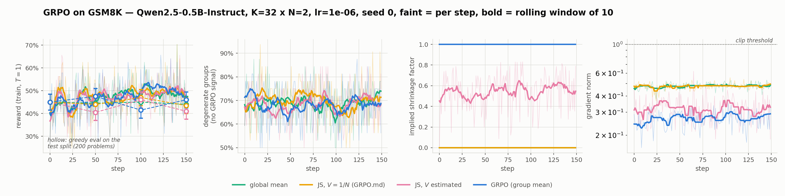

# Shrinkage baselines for GRPO on GSM8K

GRPO estimates each prompt's baseline from the N completions sampled for that
prompt alone. With N small that mean is noisy. The given spec
([`GRPO.md`](GRPO.md)) replaces it with a positive-part James–Stein estimator
that pulls each group mean toward the batch mean, with the shrinkage constant
fixed by assuming unit per-sample reward variance. This implements it, five
alternative baselines behind one registry, and measures whether it helps —
Qwen2.5-0.5B-Instruct, GSM8K, one RTX 5080 for development and two RTX 5090s
for the three-seed sweeps.

Full write-up in ICLR format: [`report/report.pdf`](report/report.pdf)
(English), [`report/report_zh.pdf`](report/report_zh.pdf) (中文). This README
is the code map and the headline numbers; the derivations, the conformance
audit, the corrections record and the withdrawn measurement are in the report.
Prior work: [arXiv:2511.03710](https://arxiv.org/abs/2511.03710) (shrinkage
baselines for RLVR, = `js_loo` here) and
[arXiv:2602.05165](https://arxiv.org/abs/2602.05165) (EBPO). Neither has
released code, so everything here is written from scratch.

## Findings

1. **The spec applied to raw 0/1 rewards collapses onto the global mean.**
   `GRPO.md` states its precondition — rewards rescaled so the per-sample
   variance is ≈ 1, which is what makes `V = 1/N` — but 0/1 rewards have
   `p(1−p) ≤ 0.25` and the spec's own pseudocode takes the raw matrix. The
   shrinkage factor then goes to 0: the group structure is gone, and for
   N ≥ 4 the estimator is *worse* than plain GRPO in simulation. The collapse
   is monotone in K, and at N = 2 it is an algebraic identity for every K > 6
   (`S ≤ K/4` while `c = (K−3)/N`). In training, `js_fixed` logged shrink = 0
   on all 150 steps of all three seeds at K = 32, N = 2.
2. **Honouring the precondition restores Stein's behaviour.** `js_pooled` is
   the spec's ten steps applied after dividing the rewards by the pooled
   within-group std, scaled back (a test pins the identity to 3e-16). Its
   shrinkage factor follows the closed form `Nτ²/(1+Nτ²)` to within 0.02, and
   its baseline MSE is 16–54% below vanilla GRPO in simulation, the gain
   growing as N shrinks. Read it as the spec with its own assumption honoured,
   not as a different method. None of it shows up as accuracy: see 3.
3. **End-to-end accuracy cannot resolve the effect at this scale, and the
   sweep measures why.** Three seeds at each of two group shapes leave every
   arm inside its own seed-to-seed spread. At K = 32, N = 2 `js_fixed` and
   `global` are provably the same algorithm, so their three same-seed runs are
   a replicate pair: they finish 0.5, 6.5 and 1.5 points apart, against a
   literature effect of 0.65–1.5 points. The per-step gradient noise/signal
   ratio is 58–182 for every baseline alike. The "more stable training" claim
   finds no support: no arm clipped a gradient step, entropy fell identically.
4. **The spec's optional "divide by the within-group std" is unsafe here.**
   A degenerate group has std 0 *and*, under any shrinkage baseline, a
   non-zero advantage by design — so the usual `std + 1e-4` multiplies it by
   1e4 (measured at K=8, N=8: `adv_var` 1.07e5, `grad_norm` 1.7e3, against
   0.57 and 1.2 when zero-spread groups are left unscaled).

An earlier draft's headline — a paired gradient-variance measurement, `js_loo`
at −21.4% [−51.5, −7.8] — is **withdrawn**: it was produced with a projection
bug and an off-policy sampler. Both are fixed and tested, but the rerun did
not fit the time budget. See [Future work](#future-work).

## Quickstart

```bash
uv sync && python main.py smoke        # torch cu129 gate; the RTX 5080 is sm_120
python -m pytest tests/ -q             # 162 tests
```

```bash
python main.py synthetic --k 32 --n 2 4 8 16            # simulation + figure 1
python main.py train --baseline js_pooled --steps 200   # single GRPO run
python main.py sweep --seeds 0 1 2 --k 32 --n 2 --steps 150 \
    --baselines vanilla js_fixed js_pooled global --track-grad-var
python main.py compare --glob 'train_*_k32n2_s*.jsonl'  # paired stats over a sweep
python main.py gradvar --batches 200                    # estimator-level, ~2 h
python main.py eval --n-problems 200
python main.py prompt                                   # compare system prompts
python main.py figures                                  # rebuild every figure
python main.py report                                   # compile both reports
```

`train`/`sweep` expose the full knob set: `--beta` (KL to a frozen reference,
k3), `--num-iterations` (inner updates per rollout), `--scale`
(`none`/`group`/`batch`), `--epsilon`, `--loss-norm`, `--lr`, `--k`, `--n`,
`--temperature`, `--repetition-penalty` (1.0 — see [Corrections](#corrections)),
`--track-grad-var`. `sweep` runs one arm per baseline from the same seed, so
every arm walks the same prompt stream — a paired A/B, not four independent
runs. `compare`, `figures` and `plot_training.py` key runs by (baseline, seed)
and refuse a glob that mixes group shapes. The K sweep of Figure 1 is not
wired into `main.py`:

```bash
python experiments/synthetic_mse.py --k 4 8 16 32 64 --n 8 --trials 3000 --out results/synthetic_k_sweep.json
```

## Baselines

Registered in [`src/grpo_eva/baselines.py`](src/grpo_eva/baselines.py),
interface mirroring verl's `register_adv_est` so any arm drops into verl
through `to_verl_style`.

| name | baseline `b[k,i]` | role |
|---|---|---|
| `vanilla` | group mean | GRPO, the incumbent |
| `rloo` | leave-one-out group mean | unbiased variance-reduction control |
| `global` | batch mean | **ablation**: what over-shrinkage degenerates to |
| `js_fixed` | JS toward grand mean, `V = 1/N` | GRPO.md as written |
| `js_pooled` | JS toward grand mean, `V` estimated | **the spec with its σ²≈1 precondition honoured** |
| `js_loo` | two-level leave-one-out shrinkage | arXiv:2511.03710 |

Without `global` the comparison is uninterpretable: "James–Stein helps" cannot
be told apart from "any baseline other than the group mean helps". The training
loop turns off everything that could confound the A/B — β = 0, no std scaling,
constant loss normalisation — for every arm at once.

## Simulation, ground truth known

`p_k ~ Beta(1.2, 2.2)` (mean 0.35, matching the model's observed pass-rate
spread; `τ²/σ² = 0.294`), rewards `~ Bernoulli(p_k)`, K = 32, 2000 trials.
MSE of the baseline against the true `p_k`, relative to `vanilla`:

| N | degenerate groups | `global` | `js_fixed` | `js_pooled` | `js_loo` |
|---|---|---|---|---|---|
| 2  | 64.5% | −39.6% | **−39.6%** | −54.4% | −51.3% |
| 4  | 36.7% | +17.2% | **+17.2%** | −40.8% | −40.0% |
| 8  | 18.7% | +131.1% | **+131.0%** | −26.7% | −27.0% |
| 16 | 8.9%  | +355.5% | **+258.8%** | −15.8% | −16.0% |

`js_fixed` is `global` for N ≤ 4 and within 0.1% of it at N = 8. `js_pooled`'s
measured shrink factor is 0.386 / 0.547 / 0.705 / 0.827 at N = 2 / 4 / 8 / 16,
within 0.02 of the empirical-Bayes prediction `Nτ²/(1+Nτ²)`. `rloo` has exactly
`vanilla`'s MSE — leave-one-out changes the baseline's independence, not its
point estimate.

Sweeping K at N = 8 (3000 trials) shows the collapse is monotone in K:

| K | 4 | 8 | 16 | 32 | 64 |
|---|---|---|---|---|---|
| `js_fixed` shrink | 0.333 | 0.058 | 0.006 | 0.000 | 0.000 |
| `js_fixed` MSE | +1.0% | +84.3% | +121.7% | +130.2% | +133.6% |
| `global` MSE | +99.1% | +116.4% | +125.5% | +130.5% | +133.6% |
| `js_pooled` MSE | −9.3% | −18.7% | −24.4% | −26.8% | −28.1% |

At K = 4 the specified method is roughly neutral, so a small-K experiment would
show nothing wrong; by K = 64 it is `global` to every digit. K is the rollout
prompt count, not the backward micro-batch — this project runs 8 and 32, the
paper 64, production hundreds to thousands.


## Three seeds, two group shapes

Qwen2.5-0.5B-Instruct, full fine-tune, GSM8K rule-based correctness reward,
512 new tokens, bf16 + gradient checkpointing, lr 1e-6, 150 steps, K·N = 64 in
both shapes. Run 2026-09-04 on two RTX 5090s (`SERVER_RUNBOOK.md`; raw logs in
`results/autodl_20260904_logs/`, per-step logs in
`results/train_*_k{8n8,32n2}_s{0,1,2}.jsonl`). Every run starts from the same
checkpoint, so `eval@0` is 45.0% for all 24. Every eval scores the same 200
test problems greedily in the same order. `rloo` and `js_loo` were not run.

| K×N | arm | final (per seed) | mean ± sem | vs `vanilla` | p (paired t, df=2) | shrink | collapsed |
|---|---|---|---|---|---|---|---|
| 8×8 | `vanilla` | 44.5 / 42.0 / 47.5 | 44.7 ± 1.6 | | | 1.000 | 0 |
| 8×8 | `js_pooled` | 44.0 / 45.5 / 47.0 | 45.5 ± 0.9 | +0.8 ± 1.3 | 0.60 | 0.85 | 0–1 |
| 8×8 | `js_fixed` | 44.0 / 47.5 / 46.0 | 45.8 ± 1.0 | +1.2 ± 2.2 | 0.65 | 0.21 | 38–44 |
| 8×8 | `global` | 48.5 / 44.0 / 45.0 | 45.8 ± 1.4 | +1.2 ± 1.9 | 0.61 | 0.000 | 150 |
| 32×2 | `vanilla` | 46.0 / 45.5 / 44.5 | 45.3 ± 0.4 | | | 1.000 | 0 |
| 32×2 | `js_pooled` | 41.0 / 46.0 / 47.5 | 44.8 ± 2.0 | −0.5 ± 2.4 | 0.85 | 0.56 | 0–1 |
| 32×2 | `js_fixed` | 43.5 / 42.0 / 41.5 | 42.3 ± 0.6 | −3.0 ± 0.3 | 0.009 | 0.000 | 150 |
| 32×2 | `global` | 44.0 / 48.5 / 43.0 | 45.2 ± 1.7 | −0.2 ± 1.6 | 0.93 | 0.000 | 150 |

"collapsed" counts steps with shrink exactly 0, out of 150. Degenerate groups:
25–28% of groups per step at N = 8, 68–70% at N = 2.

**At K = 8, N = 8 nothing is resolved.** Every arm is within 1.2 points of
`vanilla`, every s.e.m. exceeds the difference, every p is about 0.6. The same
arm moves 3–5 points between seeds; seed 0 alone would have said `global` beats
`vanilla` by 4.0 points (McNemar p = 0.039), seeds 1 and 2 put it at +2.0 and
−2.5.

**At K = 32, N = 2 the one significant row is the noise floor.** `js_fixed` at
−3.0 ± 0.3 (p = 0.009) reads as a finding, but at this shape `js_fixed` *is*
`global`: identical advantages on every batch, verified bit-for-bit at step 1,
the two processes diverging at step 2 only because sampled generation is not
reproducible on GPU. So the two arms are three same-seed replicates of one
algorithm:

| seed | `global` | `js_fixed` | difference |
|---|---|---|---|
| 0 | 44.0% | 43.5% | +0.5 |
| 1 | 48.5% | 42.0% | +6.5 |
| 2 | 43.0% | 41.5% | +1.5 |

Pooling them as the six runs they are gives −1.6 ± 1.0 against `vanilla` and
the significance is gone. A df = 2 t-test on three differences that happen to
land within 0.5 of each other produces p < 0.01 from nothing. The effect under
test is 0.65–1.5 points (arXiv:2511.03710 Table 2, same model and task, K = 64,
500 steps, 5 seeds), so the noise floor is 2–5x the effect; resolving it needs
on the order of 20–40 seeds per arm.

What the sweep does establish is structural: the spec verbatim discards the
group structure on 100% of steps at N = 2 (25–30% at N = 8) while `js_pooled`
keeps 56% and 85% of it, the mild shrinkage Stein's result asks for. And the
stability claim finds no support — no arm clipped a gradient step, entropy fell
from 0.52 to 0.26–0.33 for every arm alike, and the noise/signal ratio is
58–182 with 32–45% of steps returning a non-positive signal estimate (reported
as right-censored, not dropped, which would bias the median down).




The first sweep — five arms, seed 0 only, under the 1.1 sampler — is superseded
and kept in the report (Appendix C) with its clip-count and entropy differences
marked as off-policy artefacts.

## Conformance with GRPO.md

[`tests/test_spec_conformance.py`](tests/test_spec_conformance.py) transcribes
section 3.2's ten steps and, separately, the 3.3 Python listing character for
character, and runs both against the implementation. Away from the edge cases
they agree to 1e-12. On its own edge cases the listing does not run: `K < 4`
raises `IndexError` (`X_bar` is 0-d, `unsqueeze(1)` out of range) and `S = 0`
raises `TypeError` (Python's `max(S, eps)` returns a float, which
`torch.clamp` rejects) — the case step 7 claims to handle. Two departures, both
asserted: we follow the prose for `K < 4` (per-group means, not the listing's
global mean, which would no longer be GRPO), and clamp to 0 for `S = 0`, which
is observationally identical. Section 2's σ² ≈ 1 precondition is absent from
the listing; that is the over-shrinkage above, and `js_pooled` is the listing
with the rescaling put back — pooled, because 30–70% of groups have std 0.

## Corrections

Found in review after the first draft, all fixed in code; every number above is
labelled by which sampler produced it.

* **Off-policy rollouts (2026-09-04).** `generate()` did not pass
  `repetition_penalty`, so it fell through to the checkpoint's 1.1. Completions
  were sampled from a penalised distribution while the loss used the raw
  policy's logprobs, in every arm of every experiment. Now 1.0 explicitly. The
  three-seed sweeps are post-fix; the seed-0 sweep and `gradvar` are not.
* **Projection bug (2026-09-03).** Hutchinson probes reused random entries
  across equal-shaped parameter tensors. Fixed, plus a probe-free pair
  estimator (`E<g_b, g_b'> = ||E[g]||²` for disjoint batches); both tested
  against exact covariance on simulated gradients.
* **Completion mask (2026-09-04).** Only `<|im_end|>` counted as a stop token;
  Qwen2.5 also stops on `<|endoftext|>`, its pad token, so such a completion
  scored as 512 valid tokens. The mask now stops on every terminator plus pad.
* **Shrink diagnostic (2026-09-04).** Groups with `x_k = x̄` were logged as
  unshrunk rather than undefined. Synthetic tables regenerated; `global` now
  reads its definitional 0, MSE columns moved by < 1.5 points.

Two engineering notes for anyone reading the timings: gradient checkpointing
sets `use_cache=False`, which silently makes generation quadratic in length
(toggling it around the rollout took a step from ~57 s to ~25 s); and pure bf16
at lr 1e-6 rounds most of the update away — 2.3% of sampled weights change per
step — but the fp32-master recipe does not fit 16 GB, so all arms share it.

## Where to look

| | |
|---|---|
| the estimators | [`src/grpo_eva/baselines.py`](src/grpo_eva/baselines.py) |
| does it match the given spec? | [`tests/test_spec_conformance.py`](tests/test_spec_conformance.py) |
| the GRPO loop | [`src/grpo_eva/grpo.py`](src/grpo_eva/grpo.py) |
| the three-seed sweep, raw | `results/train_*_k{8n8,32n2}_s{0,1,2}.jsonl`, `results/autodl_20260904_compare_*.txt` |
| derivations, conformance audit, withdrawn measurement | [`report/report.pdf`](report/report.pdf), [`report/report_zh.pdf`](report/report_zh.pdf) |

## Related work

[arXiv:2511.03710](https://arxiv.org/abs/2511.03710) is the same idea with its
preconditions handled — both variances estimated from the batch, both levels
leave-one-out so the gradient stays unbiased, no hyper-parameters; that is
`js_loo`. EBPO ([arXiv:2602.05165](https://arxiv.org/abs/2602.05165)) shrinks
toward a running global prior instead, and its selling point — an all-zero
group still gets a signal — is the mechanism this project files under bias.
Efron & Morris (1975) applied James–Stein to binomial proportions, fixing
σ² ≠ 1 with an arcsine transform rather than pooling.
Dr.GRPO ([arXiv:2503.20783](https://arxiv.org/abs/2503.20783)) is why
`scale=none` is the default. Full discussion in the report.

## Tests

```bash
python3 -m pytest tests/ -q
```

162 tests: shape/finiteness contracts, K<4 and S=0 and N=1 edge cases, the
closed-form leave-one-out algebra against a naive O(K²) loop, the verl adapter
under row shuffling, GSM8K answer extraction, spec conformance (the ten steps
and the verbatim 3.3 listing, including its two crashes, and `js_pooled` ≡ spec
after pooled-std rescaling), the claims above stated as assertions, CPU
random-projection regression checks, the pair estimator and the per-step
micro-batch estimator on simulated gradients, the completion mask on both Qwen
terminators, and the sampler default.

## Status

- [x] Phase 0 — GPU env: torch 2.13.0+cu129, sm_120 gate passed, 14.5 GiB VRAM free
- [x] Phase 1 — estimators, tests, synthetic validation (CPU only)
- [x] Phase 2 — GRPO loop, Qwen2.5-0.5B-Instruct + GSM8K rule-based reward
- [x] Phase 3 — projection bug corrected, pair estimator added and tested on simulated gradients (not rerun on the model, see below)
- [x] Phase 4 — 5-arm training sweep, seed 0, 1.1 sampler (superseded)
- [x] Phase 4b — K·N = 64 at N = 2 and N = 8, seeds 0–2, corrected sampler, gradient variance logged (2026-09-04, 2× RTX 5090, ~35 min per arm)

## Future work

- **Rerun the gradient-variance measurement on the model.** Phase 3's numbers
  come from simulated gradients; the on-model rerun was out of the time budget.
  `python main.py gradvar --batches 200` is the command, ~2 h per shape.
- **Upstream the adapter.** The `to_verl_style` adapter is in place and tested,
  but no PR has been submitted to verl.
- **Wider coverage.** `rloo` and `js_loo` were left out of the Phase 4b sweep,
  and the pooled-std rescaling has only been checked at K·N = 64. Efron &
  Morris's arcsine transform is the more orthodox fix for σ² ≠ 1 and is untried.
