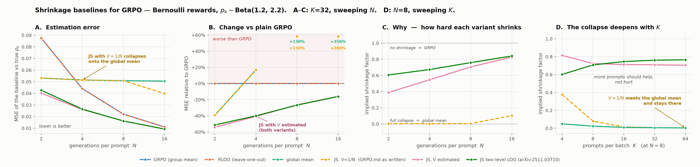
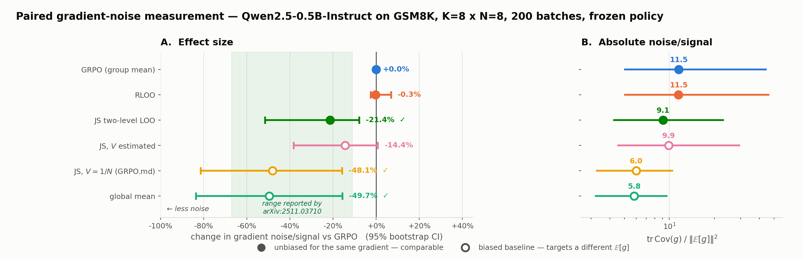
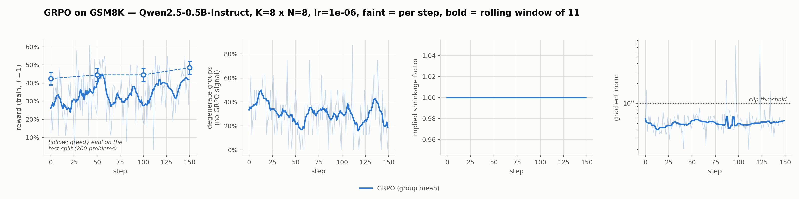

# Shrinkage baselines for GRPO on GSM8K

GRPO estimates each prompt's baseline from the N sampled completions of that
prompt alone. With N small that mean is noisy. This replaces it with a
James–Stein / empirical-Bayes estimator that pulls each group mean toward the
batch mean, and measures whether that helps — on
Qwen2.5-0.5B-Instruct, GSM8K, one RTX 5080.

Method spec: [`GRPO.md`](GRPO.md) (given).
Prior work: [arXiv:2511.03710](https://arxiv.org/abs/2511.03710) (shrinkage
baselines for RLVR) and [arXiv:2602.05165](https://arxiv.org/abs/2602.05165)
(EBPO). Neither has released code, so everything here is a from-scratch
implementation.

### Three results

**Phase 3 correction (2026-09-03):** The historical gradient-noise numbers
and Figure 2 below are not validated and must be remeasured. The original
projection code reused random entries across equal-shaped parameter tensors,
invalidating its covariance estimate. The corrected code uses a continuous
random stream per probe and records `probe_scheme="gaussian_stream_v2"`.
This affects the standalone `gradvar` measurement, not `train`/`sweep`, their
accuracy evaluations, or their checkpoints.

**Sampler and mask corrections (2026-09-04):** three defects found in review,
all fixed in code, none yet re-measured.

* **Every rollout before this date was off-policy.** `generate()` passed
  temperature, top-p and top-k but not `repetition_penalty`, so it fell
  through to the checkpoint's `generation_config.json`, where
  Qwen2.5-Instruct ships **1.1** (transformers applies it whenever it is not
  1.0). Completions were sampled from a repetition-penalised distribution
  while the loss used the raw policy's logprobs: off-policy without an
  importance correction, for every arm alike, in `train`/`sweep`, `gradvar`,
  `eval` and `select_prompt`. The loop now passes 1.0 explicitly
  (`--repetition-penalty`). Paired between-arm comparisons in the existing
  runs are still internally consistent, but they compare baselines under a
  sampler that is not π<sub>θ</sub>. The seed-0 sweep, the seed-1 sweep in
  progress, both historical `gradvar` files and every number in this README
  carry the 1.1 sampler; any headline number needs a rerun.
* **The completion mask stopped only on `<|im_end|>`.** Qwen2.5's
  `generation_config` also terminates on `<|endoftext|>`, which is the pad
  token, so a completion that ended that way was scored as 512 valid tokens
  including its padding — logprobs, gradient and `completion_len`. The mask
  now stops on every terminator `generate()` knows plus the pad id. How
  often it happened in past runs is unknown (texts were not logged).
* **The logged `shrink` counted groups with `x_k = x̄` as 1.0.** Such groups
  say nothing about the shrinkage (0/0) and are now NaN and excluded.
  `global`'s 0.025 in the sweep table is that artefact — its value is 0 by
  definition — and every other arm is inflated by a few hundredths on
  affected steps.

1. **The spec's formula applied to raw 0/1 rewards does not work.** GRPO.md
   states its precondition — rewards rescaled so the per-sample variance is
   ≈ 1, which is what makes `V = 1/N` — but 0/1 correctness rewards have
   `p(1−p) ≤ 0.25` and the spec's own pseudocode takes the raw matrix. Run
   that way (`js_fixed`) the shrinkage factor collapses to 0.004: the
   estimator becomes the global mean, the group structure is gone, and for
   N ≥ 4 it is *worse* than plain GRPO. Synthetic measurements support this;
   gradient confirmation awaits remeasurement.
2. **Honouring the precondition fixes it, on synthetic MSE.** `js_pooled` is
   exactly GRPO.md's ten steps applied after dividing the rewards by the
   pooled within-group std (`tests/test_spec_conformance.py` pins the
   identity; a per-group std is unusable because 30–40% of groups have
   std 0). Read it as "the spec with its stated assumption honoured", not
   as a different method. The previously reported **−21.4% gradient noise
   [−51.5, −7.8]** is an unvalidated historical result, not evidence of a
   gradient-noise reduction until Phase 3 is rerun.
3. **The spec's optional "divide by the within-group std" is unsafe here.**
   Degenerate groups have std 0 *and*, under shrinkage, a non-zero advantage by
   design — so the usual `std + 1e-4` multiplies it by 1e4.

### The measurement floor

Two runs of the **same arm, same seed, same config** diverge by **3.0
points** of test accuracy:

| | run A | run B |
|---|---|---|
| eval@0 | 42.5% | 42.5% |
| eval@50 | 44.5% | 43.5% |
| eval@100 | 44.5% | 44.5% |
| eval@final | **48.5%** | **45.5%** |

`eval@0` is identical because greedy decoding is deterministic, so the
divergence is entirely in training. `torch.manual_seed` does not make
sampled generation reproducible on GPU — kernel selection and reduction
order are not fixed.

The effect this project is trying to detect is **0.65–1.5 points**: Table 2
of arXiv:2511.03710, Qwen2.5-0.5B-Instruct on GSM8K, JS minus GRPO at
N = 8 / 4 / 2, with K = 64 prompts per step, 500 steps, averaged over 5
seeds. **The noise floor is 2–5x the effect**, and this project runs K = 8
for 150 steps. End-to-end accuracy cannot resolve it on one GPU, which is
why the headline measurement here is gradient noise on paired rollouts
instead — same batch, every baseline, so the rollout randomness cancels by
construction.

### Where to look

| | |
|---|---|
| the estimators | [`src/grpo_eva/baselines.py`](src/grpo_eva/baselines.py) |
| does it match the given spec? | [`tests/test_spec_conformance.py`](tests/test_spec_conformance.py) |
| the GRPO loop | [`src/grpo_eva/grpo.py`](src/grpo_eva/grpo.py) |
| what was measured, and what was not | [Phase 3](#phase-3--paired-gradient-variance) |

```bash
uv sync && python main.py smoke        # torch cu129; the RTX 5080 is sm_120
python -m pytest tests/ -q             # 162 tests
```

## CLI

```bash
python main.py smoke                                    # GPU arch gate
python main.py synthetic --n 2 4 8 16                   # phase 1 + figure
python main.py train --baseline js_pooled --steps 200   # phase 2
python main.py sweep  --baselines vanilla js_fixed js_pooled global
python main.py gradvar --batches 200                    # phase 3
python main.py eval --n-problems 200
python main.py prompt                                   # compare system prompts
python main.py figures                                  # rebuild every figure
```

`train`/`sweep` expose the full GRPO knob set: `--beta` (KL to a frozen
reference, k3 estimator), `--num-iterations` (mu, inner updates per rollout),
`--scale` (`none`/`group`/`batch`), `--epsilon` (PPO clip), `--loss-norm`,
`--lr`, `--k`, `--n`, `--temperature`, `--repetition-penalty` (1.0; see the
2026-09-04 correction), `--track-grad-var` (per-step gradient noise/signal,
arXiv:2511.03710 eq. 17–18 across micro-batches, ~1.5 s/step). With
`--beta 0.04` the reference model brings peak memory to 11.9 GiB of 15.9.

`sweep` runs one arm per baseline from the same seed, so every arm sees the
same prompt stream — a paired A/B rather than four independent runs.
`--seeds 0 1 2` repeats the whole set per seed; `compare` then pairs arms
within a seed and aggregates across seeds.

## Baselines

Registered in `src/grpo_eva/baselines.py`, interface mirroring verl's
`register_adv_est` so any of them can be dropped into verl via `to_verl_style`.

| name | baseline `b[k,i]` | role |
|---|---|---|
| `vanilla` | group mean | GRPO, the incumbent |
| `rloo` | leave-one-out group mean | unbiased variance-reduction control |
| `global` | batch mean | **ablation**: what over-shrinkage degenerates to |
| `js_fixed` | JS toward grand mean, `V = 1/N` | GRPO.md as written |
| `js_pooled` | JS toward grand mean, `V` estimated | **the spec with its σ²≈1 precondition honoured** (= spec on `r / pooled_std`) |
| `js_loo` | two-level leave-one-out shrinkage | arXiv:2511.03710 "JS2" |

## Phase 1 result — synthetic, ground truth known

```bash
python main.py synthetic --k 32 --n 2 4 8 16 --trials 2000
```

`p_k ~ Beta(1.2, 2.2)` (mean 0.35, matching a small model's GSM8K pass-rate
spread), rewards `~ Bernoulli(p_k)`, K=32 prompts, 2000 trials.
MSE of the baseline against the true `p_k`, relative to `vanilla`:

| N | degenerate groups | `global` | `js_fixed` | `js_pooled` | `js_loo` |
|---|---|---|---|---|---|
| 2  | 64.6% | −39.3% | **−39.3%** | −54.1% | −51.3% |
| 4  | 36.5% | +16.9% | **+16.9%** | −40.7% | −40.0% |
| 8  | 18.5% | +129.9% | **+129.9%** | −26.4% | −26.8% |
| 16 | 8.9%  | +356.2% | **+260.2%** | −15.9% | −16.1% |

Two findings:

1. **`js_fixed` is numerically identical to `global` for N ≤ 8.** Its implied
   shrinkage factor is 0.004 — it discards the group structure entirely and
   stops being GRPO. `V = 1/N` assumes σ²≈1, but 0/1 rewards have
   σ²=p(1−p)≤0.25, so `c` is ≥4× too large. For N ≥ 4 it is *worse* than
   plain GRPO.
2. **Estimating `V` fixes it**, and the gain grows as N shrinks
   (−15.9% at N=16 → −54.1% at N=2), which is the regime the method claims.

`rloo` has exactly the same MSE as `vanilla` — leave-one-out changes the
*independence* of the baseline, not the point estimate. Its effect shows up in
`E[(r−b)²]`, not here.



## Phase 2 — GRPO on GSM8K

```bash
python main.py train --baseline js_pooled --steps 200
```

Qwen2.5-0.5B-Instruct, full fine-tune (no LoRA), K=8 prompts x N=8 generations,
512 new tokens, bf16 + gradient checkpointing on one RTX 5080.
**11.0 GiB peak / 14.5 GiB, ~25 s/step.**

Two things that were not free:

* **The prompt.** `experiments/select_prompt.py` compares four. A "reason step
  by step + \boxed{}" prompt rambles past the token budget on 38% of problems;
  the chosen terse variant truncates 13% at 512 tokens and roughly doubles
  accuracy. One-shot exemplars did not help. Truncated correct reasoning scores
  0, which is reward noise the estimator would otherwise have to absorb.
* **KV cache.** `gradient_checkpointing_enable()` sets `use_cache=False` on the
  config, which silently makes `generate()` quadratic in length. Toggling
  checkpointing off around the rollout and back on for the backward pass took a
  step from ~57 s to ~25 s.

Also note the measurement scale problem: over 60 test problems at
temperature 1.0 the same prompt scored 28.3% and 18.3% on two runs
(SE ~5pp). Accuracy at this scale cannot resolve the ~1pp effect the paper
reports — which is why Phase 3 measures the gradient directly.

## Phase 3 — paired gradient variance

**Remeasurement required.** Existing result files do not contain the original
gradients, so the projection error cannot be repaired by recomputing p-values
or bootstrapping the stored summaries. After the training sweep finishes, run
the corrected measurement into a new file to preserve the historical record:

```bash
python experiments/grad_variance.py --batches 200 --k 8 --n 8 --seed 0 --out results/grad_variance_k8n8_v2.json
```

The command has not yet been rerun (the GPU is on the seed-1 sweep). The
table and Figure 2 below remain historical; `python main.py figures` still
reads the old `_long.json` file.

**The Hutchinson estimator is a poor instrument for this ratio even with
the projection fixed.** `||E[g]||²` is obtained as the exact `E||g||²`
minus the probe estimate of `tr Cov(g)`, and in the historical run it is 8%
of `E||g||²` (0.16 of 2.06). The probe error on `tr Cov` with 24 probes is a
few percent at best and does not shrink with more batches, so the "signal"
is a small difference of two large numbers and the ratio inherits an error
the batch bootstrap cannot see. The old files did not keep the per-probe
projections, so this cannot be quantified after the fact; the script now
writes `trace_cov_probe_se` next to `signal_sq` so the next run can.

The rerun therefore also reports a **probe-free estimator**: for
independent batches `E<g_b, g_b'> = ||E[g]||²` exactly, so batches are
paired off (0,1), (2,3), …, each pair gives one unbiased sample of
`||E[g]||²` (the inner product) and one of `E||g||²` (the mean squared
norm), and the bootstrap resamples pairs — the same idea as the paper's own
instrument (its eq. 17–18, across micro-batches). Costs a CPU copy of one
gradient per arm per pair. Fields are prefixed `pair_`; CPU tests recover
known `tr Cov` and `||E[g]||²` from simulated gradients.

Every baseline scores the **same rollouts**, so rollout randomness cancels and
the baseline is the only thing that differs. The policy is frozen: this
measures the estimator, not a training outcome. Reports `tr Cov(g) / ||E[g]||^2` — scale-invariant, because the baselines
produce gradients whose magnitude differs ~5x and raw `tr Cov` would just rank
them by scale. `tr Cov` comes from Hutchinson probes; `||E[g]||^2` from the
exact per-batch norms minus it. Intervals are a paired bootstrap over batches
(same resample for every arm, so the shared rollout noise cancels).

**Historical result, unvalidated: 200 batches, Qwen2.5-0.5B-Instruct, K=8 x N=8, mean accuracy 29.1%:**

| baseline | noise/signal | vs GRPO | 95% CI | |
|---|---|---|---|---|
| `vanilla` | 11.5 | — | — | |
| `rloo` | 11.5 | −0.3% | [−2.5, +6.9] | no difference — sanity check |
| **`js_loo`** | **9.1** | **−21.4%** | **[−51.5, −7.8]** | **significant** |
| `js_pooled` | 9.9 | −14.4% | [−38.2, +0.8] | marginal |
| `js_fixed` | 6.0 | −48.1% | [−81.3, −15.8] | biased — see below |
| `global` | 5.8 | −49.7% | [−83.5, −15.6] | biased — see below |

The old interval excluded zero, but that does not correct the projection
error or establish agreement with the paper's result.

**`js_fixed` and `global` look best on this metric and that reading is wrong.**
Only leave-one-out baselines are independent of the reward they are subtracted
from, so only `rloo` and `js_loo` are unbiased for the same gradient. The other
two target a *different* `E[g]`: giving an all-correct group a positive
advantage inflates `||E[g]||^2` with a component that merely pushes up easy
prompts. A larger denominator is not more signal.

Agreement between `rloo` and `vanilla` did not validate the measurement:
their proportional gradients can agree even under an incorrect projection.
CPU regression tests now compare projected covariance with exact covariance
and check that opposite gradients in separate parameters do not cancel.

The historical `js_fixed` versus `global` comparison also needs remeasurement.



### What this does not show

* 48 batches was **not** enough — every interval crossed zero. The result above
  needed 200. Do not read effect sizes off short runs here.
* `js_loo` is checked against the arXiv PDF (Sec. 3.3: eq. 10 for the two
  leave-one-out means, eq. 13–14 for the plug-in variances, eq. 15 for the
  coefficient with its `(n-1)/n` factor, eq. 16 for the baseline).
  `baselines.py` keeps the `lambda_correction` switch for ablation only.
* End-to-end training accuracy is not measured. At this scale it cannot be:
  the same prompt scored 28.3% and 18.3% on two 60-problem evals.

## Training sweep

```bash
python main.py sweep --baselines vanilla js_fixed js_pooled js_loo global --steps 150
python main.py compare
```

Five arms from the same seed, so every arm walks the same prompt stream
(verified: identical reward and degenerate-group fractions at step 0), and
every eval scores the same 200 problems in the same order.

| arm | eval@0 | eval@final | Δ | p | shrink | collapsed |
|---|---|---|---|---|---|---|
| `vanilla` | 42.5% | 45.5% | +3.0 | 0.24 | 1.000 | 0/150 |
| `js_pooled` | 42.5% | 45.0% | +2.5 | 0.27 | 0.850 | 1/150 |
| `js_loo` | 42.5% | 45.5% | +3.0 | 0.21 | 0.818 | 0/150 |
| `js_fixed` | 42.5% | 47.0% | +4.5 | 0.11 | 0.202 | 64/150 |
| `global` | 42.5% | 47.5% | +5.0 | 0.06 | 0.025 | 133/150 |

`shrink` for `global` reads 0.025 rather than its definitional 0 because the
diagnostic then counted groups with `x_k = x̄` as unshrunk (2026-09-04
correction above); the other arms carry the same few-hundredths inflation.
All five arms sampled with the 1.1 repetition penalty.

**Nothing here is significant, in either direction.** No arm beats its own
starting point at p<0.05, and none differs from `vanilla` (all p ≥ 0.54). The
spread across five arms is 2.5 points — below the 3.0-point floor a single arm
shows against *itself*. **The sweep does not show that shrinkage helps
training, and it was not capable of showing it.**

Note the trap: `global` has the largest nominal gain. Read without the p
column that says "discard the group structure and GRPO improves".

What the sweep *does* establish is structural — the shrinkage column separates
into three tiers accuracy cannot resolve. Two other things the seed-0 logs
already record, and `python main.py compare` now tabulates as a stability
panel, are worth more than the accuracy column: `global` hit the gradient
clip on 36 of 150 steps against 9 for `vanilla` (`js_fixed` 16, `js_pooled`
10, `js_loo` 5), and its sampled-token entropy fell from 2.56 to 0.95 against
1.27 for `vanilla` (mean of the last 10 steps) — the over-shrunk arms push
all-correct groups up and
sharpen the policy faster. That is the mechanism behind "the spec collapses
onto the global mean", visible in training rather than in simulation. The
panel also reports the per-step reward difference against `vanilla` on the
same prompts, and, when logged with `--track-grad-var`, the paper's own
per-step gradient noise/signal (its eq. 17–18) — the direct test of the
spec's "训练更稳" claim, for every arm on the same batch.

```
vanilla 1.000  ≫  js_pooled 0.850, js_loo 0.818  ≫  js_fixed 0.202  ≫  global 0.025
```

The corrected variants keep 82–85% of the group structure; the specified one
keeps 20% and discards it outright on 43% of steps. That `js_pooled` and
`js_loo` — derived independently — land within 0.03 of each other is mutual
corroboration.



## Conformance with GRPO.md

`tests/test_spec_conformance.py` transcribes section 3.2's ten steps literally
and asserts `js_fixed` agrees to 1e-12 on both continuous and 0/1 rewards, and
that `shrunk_group_means` honours the `(K,) -> mu_shrunk` contract of 3.1.

Two departures, both asserted, plus the pseudocode's own crashes, also
asserted (the 3.3 listing is transcribed verbatim in the test file and run):

* **Step 5 contradicts the pseudocode.** The prose says K<4 returns "the
  original means" (the per-group means X); the 3.3 pseudocode returns the
  *global* mean instead — a different estimator (it is the `global` arm, no
  longer GRPO), and one that raises `IndexError`, since `X_bar` is 0-d and
  `unsqueeze(1)` is out of range for it. We follow the prose.
* **Step 7 is unreachable in the pseudocode.** "S = 0 -> shrink_factor = 1"
  is stated, but `max(S, eps)` is Python's `max`, which hands back the float
  `eps` whenever `S < eps`; `torch.clamp` then receives a float and raises
  `TypeError`. So the listing crashes on exactly the case step 7 claims to
  handle (every group mean equal — it happens at K=8 with 0/1 rewards). We
  clamp to 0 instead, which is observationally identical: S = 0 implies
  diff = 0, so mu = X_bar either way.
* **Section 2's precondition is not in the listing.** The theory assumes
  rewards rescaled to σ² ≈ 1; the code takes the raw matrix. That is the
  over-shrinkage measured above, and `js_pooled` is the listing with the
  rescaling put back.

### The std-normalisation variant is a footgun

Line 110 offers "divide by the within-group std afterwards" as an option. Under
plain GRPO that is safe on a degenerate group only because the advantage is
exactly 0 there, so `0/(0+1e-4) = 0`. **Every shrinkage baseline gives such a
group a non-zero advantage by design** — that is the point of the method — so
the same expression multiplies it by 1e4. Measured on GSM8K at K=8, N=8 with
38% degenerate groups: `adv_var` 1.07e5, `grad_norm` 1.7e3.

`scale="group"` therefore leaves zero-spread groups unscaled. With the guard:
`adv_var` 0.57, `grad_norm` 1.2.

## Tests

```bash
python3 -m pytest tests/ -q
```

162 tests: shape/finiteness contracts, K<4 and S=0 and N=1 edge cases, the
closed-form leave-one-out algebra against a naive O(K²) loop, the verl adapter
under row shuffling, GSM8K answer extraction, spec conformance (the ten steps
and the verbatim 3.3 listing, including its two crashes, and `js_pooled` ≡
spec after pooled-std rescaling), the claims above stated as assertions, CPU
random-projection regression checks, the pair estimator and the per-step
micro-batch estimator on simulated gradients, the completion mask on both
Qwen terminators, and the sampler default.

## Status

- [x] Phase 1 — estimators, tests, synthetic validation (CPU only)
- [x] Phase 0 — GPU env: torch 2.13.0+cu129, sm_120 gate passed, 14.5 GiB VRAM free
- [x] Phase 2 — GRPO loop, Qwen2.5-0.5B-Instruct + GSM8K rule-based reward
- [ ] Phase 3 — projection bug corrected, pair estimator added; remeasure with the 1.0 sampler
- [x] Phase 4 — 5-arm training sweep, 150 steps each, paired by seed (1.1 sampler; seed 1 in progress)
- [ ] Phase 4b — the spec's own regime: small N at fixed K·N = 64, ≥3 seeds, 1.0 sampler, gradient variance logged:
      ```bash
      python main.py sweep --seeds 0 1 2 --k 32 --n 2 --baselines vanilla js_fixed js_pooled global --track-grad-var --steps 150
      python main.py sweep --seeds 0 1 2 --k 8  --n 8 --baselines vanilla js_fixed js_pooled global --track-grad-var --steps 150
      python main.py compare
      ```
      `js_fixed` is GRPO.md verbatim, `js_pooled` is GRPO.md with its σ²≈1 precondition honoured, `global` is what the former collapses to, `vanilla` is GRPO; add `rloo js_loo` for the paper's unbiased variants. About an hour per arm; the N=2 block is where the synthetic gain is largest (−54% MSE) and 65% of groups are degenerate.
- [ ] Phase 5 — verl PR
